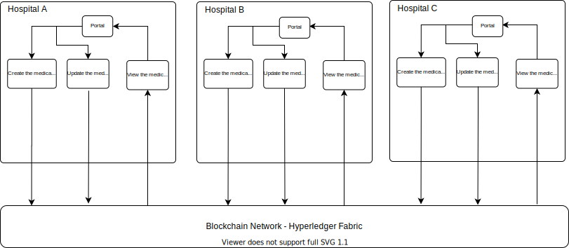

## HospitalNET
HospitalNET is a Proof of Concept blockchain network of hospitals to store and track the medical history of patients. 
Every hospitals in the network share and operate on the same copy of ledger to create, update and view the medical records of patients. This provides a consolidated view of patients's medical history to hospitals, doctors and medical professionals.

## Example Scenario
PatientBob got some issues with his stomach and got admitted to HospitalA for treatment. Since this is the first time PatientBob is visiting to any hospital PatientBob doesnot have any medical history so the DoctorA in HospitalA will diagnose the condition of PatientBob and prescribe the proper medications and store them on HospitalNET. Time goes on and again after some time PatientBob got into an accident and need a medical treatment since HospitalA doesnot cater for accident related injuries PatientBob visits to HospitalB, the DoctorB in HospitalB has no knowledge of PatientBob medical history so with PatientBob's consent DoctorB retrives the medical history of PatientBob from HospitalNET and knows that PatientBob had some issues with his stomach and was prescribed some medications by DoctorA of HospitalA. With this information about the medical history of PatientBob DoctorB now advises the proper medical procedure and medications and update the medical record of PatientBob in HospitalNET.

## In this POC we are taking 3 hospitals for example
HospitalA, HospitalB, HospitalC will act as 3 Peers in the network, and each of these peer are managed and owned individually by each hospitals, Each hospitals also has a Portal which they can use to view/update/create medical records of patients to HospitalNET.
The peers can also subscribe to events in the ledger such as creation and update of medical records under topic createdMedicalRecord and updatedMedicalRecord 

## Doctors in Hospital can do 3 tasks
1) Create a medical record for new patient if the medical record of patient has not been recorded on HospitalNET before
2) Update the medical record of existing patient's in HospitalNET
3) View the entire medical history of the patient
Note : Each patient will be uniquely identified by their SSN 

## System Architecture Diagram

## Requirement
1. Node (12.17.0)
2. NPM (6.14.4)
3. MongoDB (4.0)
4. Docker (19.03.8)
4. Docker Compose (1.25.85)
6. Visual Studio Code (1.38) 
7. IBM Blockchain Platform Extension for VS Code (1.0.31)

## Client Application
***[hospitalnet-api](./hospitalnet-api/README.md)*** is a NodeJS REST API Server to interact with the Hyperledger Fabric based blockchain network. It uses [Hyperledger Fabric SDK for Node.js version 1.4 ](https://hyperledger.github.io/fabric-sdk-node/) and TypeScript

## Smart Contract
***[hospitalnet-contract](./hospitalnet-contract/README.md)*** is the Smart Contract which facilitates the create, read and update operations of patient's Medical Records on blockchain. It also emits events for medical records create and update operations under topic createMedicalrecord and updateMedicalRecord

